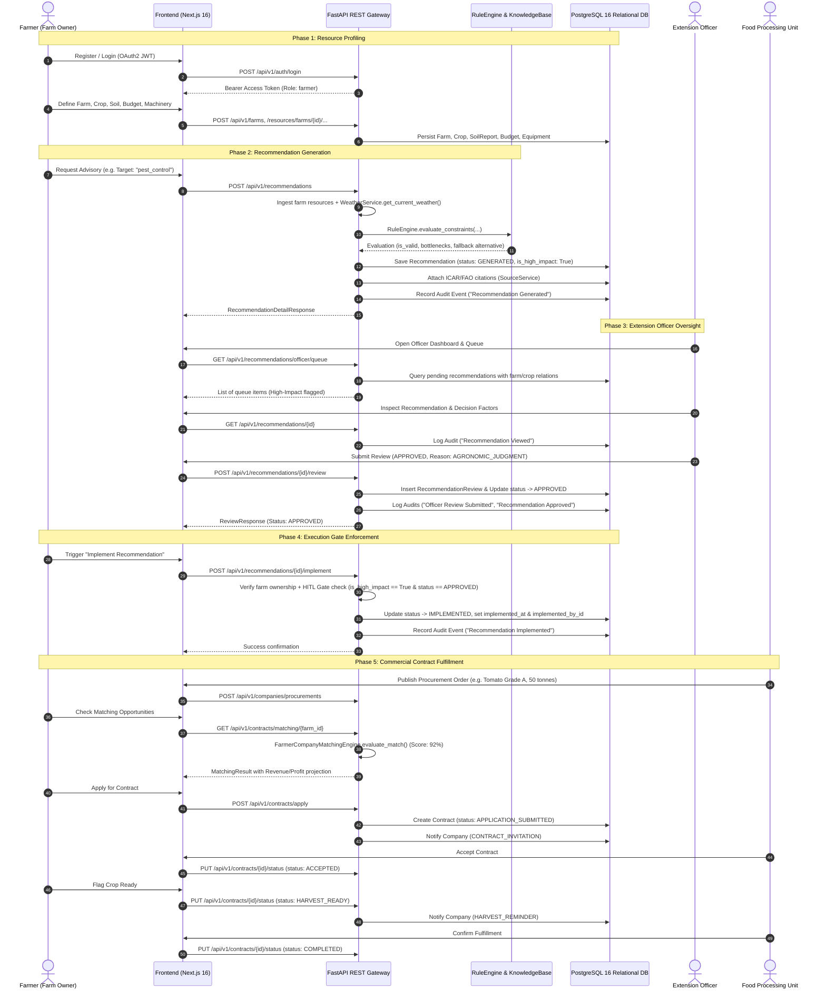
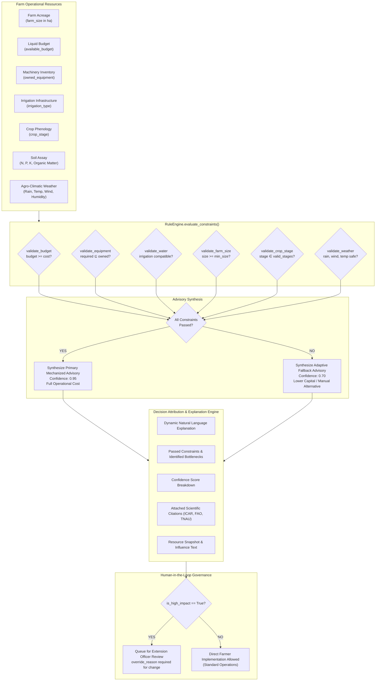

# AgriSense AI — Field Workflow Map

**Document ID:** AGRI-DOC-FWM-2026-01  
**Classification:** System Architecture, Operational Field Workflow & Compliance Mapping  
**Source of Truth:** Repository Implementation (`backend/app`, `frontend/app`, `backend/alembic`)  
**Standard References:** ISO/IEC 25010 (Software Quality), ICAR Agronomic Advisory Guidelines, Contract Farming Act Principles  

---

## 1. Purpose

This document provides a dedicated, unified field-workflow map detailing how the **AgriSense AI** system operates across its primary agricultural and commercial stakeholders. 

Rather than describing hypothetical or conceptual capabilities, this document is strictly grounded in the **actual repository implementation**. It details the verified data flows, state machines, business rule constraints, human-in-the-loop (HITL) approval gates, and immutable audit trails that govern day-to-day operations.

The system orchestrates two interconnected operational loops:

```
[ FIELD AGRONOMY ADVISORY LOOP ]
FARMER 
  ↓ 
RESOURCE / FARM DATA (Soil, Machinery, Cash, Water, Stage, Weather)
  ↓ 
RECOMMENDATION ENGINE (Deterministic 10-Action Rule Engine)
  ↓ 
HUMAN REVIEW (Extension Officer Inspection Queue)
  ↓ 
APPROVAL / REVISION (Structured Override Classification)
  ↓ 
IMPLEMENTATION (Gated Execution on Farm)
  ↓ 
AUDIT TRAIL (Append-Only Governance Log)

[ FOOD PROCESSING SUPPLY CHAIN LOOP ]
FOOD PROCESSING UNIT 
  ↓ 
PROCUREMENT REQUIREMENT (Grade, N-P-K, Moisture, Quantity, Delivery Window)
  ↓ 
FARMER MATCHING (Multi-Attribute Compatibility Engine)
  ↓ 
CONTRACT (Bilateral Legal Agreement & Lifecycle State Machine)
  ↓ 
HARVEST / FULFILLMENT (Quality Inspection & Batch Completion)
```

---

## 2. Actors

The system defines four authenticated human roles managed through Role-Based Access Control (RBAC) via JSON Web Tokens (JWT / RFC 7519), plus autonomous agronomic services:

| Actor Role | System Identifier (`UserRole`) | Primary Responsibilities | Key User Interface Routes |
| :--- | :--- | :--- | :--- |
| **Farmer** | `UserRole.FARMER` (`"farmer"`) | Registers farm parcels; records machinery inventory, working capital budgets, soil lab reports, and crop stages; triggers advisory generation; reviews explainable decision factors; executes approved field actions; applies for procurement contracts. | `/dashboard`, `/dashboard/[id]`, `/farms`, `/farms/new`, `/recommendations/[id]`, `/contracts` |
| **Agricultural Extension Officer** | `UserRole.EXTENSION_OFFICER` (`"extension_officer"`) | Monitors pending advisory queues; inspects algorithmic constraint reasoning, resource snapshots, and ICAR/FAO citations; issues certified approvals or requests revisions with structured override reasons. | `/officer`, `/officer/queue`, `/recommendations/[id]` |
| **Food Processing Unit** | `UserRole.FOOD_PROCESSING_UNIT` (`"food_processing_unit"`) | Posts raw produce procurement requirements; reviews matched farms; reviews farmer contract applications; accepts, monitors, and marks contracts harvest-ready and completed. | `/company`, `/company/procurements`, `/company/contracts` |
| **System Administrator** | `UserRole.ADMIN` (`"admin"`) | Provisions certified Extension Officers; oversees global system integrity; audits compliance records across all tenant organizations. | `/admin`, `/reports` |
| **Agronomic Rule Services** | *System Engine* | Executes deterministic constraint evaluation (`RuleEngine`), agro-climatic weather lookups (`WeatherService`), multi-attribute contract matching (`FarmerCompanyMatchingEngine`), and milestone notifications (`ReminderService`). | `backend/app/recommendations/`, `backend/app/rules/`, `backend/app/services/` |

---

## 3. End-to-End System Workflow

The interaction between field agronomy and commercial procurement is depicted below:



---

## 4. Farmer Workflow

The farmer's operational journey consists of 15 sequential steps:

### Step 1: Authentication
- The farmer navigates to `/login` or `/register`.
- Submits credentials to `POST /api/v1/auth/login` (or `/auth/register` with `role: "farmer"`).
- The system returns an OAuth2 JWT token encoding user identity and role `farmer`, stored client-side for authenticated API requests.

### Step 2: Farm Parcel Registration
- In `/farms/new`, the farmer creates a farm record specifying `name`, `location` (e.g., `"Thanjavur, Tamil Nadu"`), `farm_size` in hectares/acres, and `irrigation_type` (`"drip"`, `"sprinkler"`, `"canal"`, `"borewell"`, `"rainfed"`).
- Handled by `POST /api/v1/farms`, persisted in `farms` table with foreign key link to `farmers.id`.

### Step 3: Crop Profile Definition
- The farmer links actively cultivated crops to the parcel via `POST /api/v1/resources/farms/{farm_id}/crops`.
- Captures `crop_type` (`"paddy"`, `"tomato"`, `"wheat"`, `"chilli"`, `"maize"`), `crop_stage` (`"land_preparation"`, `"sowing"`, `"germination"`, `"vegetative"`, `"flowering"`, `"maturity"`, `"post_harvest"`), `sowing_date`, and `expected_harvest_date`.

### Step 4: Soil Nutrient Testing Records
- The farmer records certified soil laboratory assays via `POST /api/v1/resources/farms/{farm_id}/soil-report`.
- Ingests quantitative chemical parameters: `nitrogen` (kg/ha or mg/kg), `phosphorus`, `potassium`, `ph_level`, and `organic_matter` (%).

### Step 5: Working Capital Budget & Machinery Inventory
- **Budget:** Farmer sets liquid operational capital via `POST /api/v1/resources/farms/{farm_id}/budget` (`available_budget`, `allocated_budget`, `currency`).
- **Machinery:** Farmer registers owned/accessible equipment via `POST /api/v1/resources/farms/{farm_id}/equipment` (`equipment_name` such as `"tractor"`, `"sprayer"`, `"harvester"`, `"pump"`, `"trailer"`, `"spreader"`).

### Step 6: Environmental & Agro-Climatic Data
- Weather context is automatically derived for the farm's location using `WeatherService.get_current_weather(farm.location)`.
- Pulls live OpenWeatherMap API metrics or falls back to calibrated agro-climatic seasonal baselines (temperature, rainfall mm, precipitation probability %, humidity %, wind speed km/h).

### Step 7: Advisory Generation
- In `/dashboard/[id]` or `/recommendations`, the farmer selects a target operational field action from the 10 supported actions:
  - `apply_fertilizer` (Nutrient Management)
  - `irrigation` (Water Management)
  - `pest_control` (Plant Health — *High-Impact*)
  - `harvest` (Harvest Operations — *High-Impact*)
  - `machinery_hire` (Mechanization — *High-Impact*)
  - `seed_selection` (Crop Establishment)
  - `soil_amendment` (Soil Health — *High-Impact*)
  - `crop_protection` (Preventive Biocontrol — *High-Impact*)
  - `post_harvest_storage` (Post-Harvest Quality)
  - `crop_transportation` (Supply Chain Transit)
- Triggers `POST /api/v1/recommendations` with payload `{"farm_id": "<uuid>", "target_action": "<action>"}`.
- Handled by `RecommendationEngine.generate()`, which evaluates all 6 constraint categories using `RuleEngine.evaluate_constraints()`.

### Step 8: Recommendation Explanation (XAI)
- The farmer is routed to `/recommendations/[id]`.
- The UI exposes an ergonomic 5-tab breakdown:
  1. **Overview:** Immediate actionable summary, confidence gauge (0–100%), cost estimate, weather badge, growth stage, and certified review status.
  2. **Resource Snapshot:** Quantitative audit of farm capital, machinery, irrigation type, soil chemistry ratings, and natural language influence explanation.
  3. **Explanation (XAI):** Why the advisory was chosen, passed constraints table (green), identified bottlenecks (red), confidence deduction breakdown, and adaptive alternative paths.
  4. **Evidence:** Direct scientific citations from ICAR, TNAU, NCIPM, and FAO.
  5. **History:** Chronological append-only audit trail.

### Step 9: Advisory Review Workflow Intake
- When persisted, the recommendation enters lifecycle status `RecommendationStatus.GENERATED`.
- High-impact recommendations (`is_high_impact = True`) automatically display a prominent badge: `High-Impact Gate Active`.
- The banner states: *"Implementation is unavailable until an Extension Officer approves this recommendation."*

### Step 10: Extension Officer Review Notification
- If configured, an automated notification of type `REVIEW_PENDING` alerts local extension officers.
- The advisory appears in the Extension Officer's review queue.

### Step 11: Extension Officer Review Outcome
- The Extension Officer evaluates the advisory and records an approval or revision request.
- The recommendation status transitions to `APPROVED` or `NEEDS_REVISION`.

### Step 12: High-Impact Execution Gate Enforcement
- **If `status == NEEDS_REVISION`:** The farmer's UI displays a amber warning banner: *"Implementation is unavailable because an Extension Officer flagged this recommendation for field revision."* Any attempt to call `/implement` returns HTTP 400 Bad Request, and an `"Implementation Blocked"` audit event is written.
- **If `is_high_impact == True` and `status != APPROVED`:** The execution button is blocked. Attempting to force execution yields HTTP 400 Bad Request: *"Implementation blocked: High-impact recommendation requires human Extension Officer approval before execution (current status: GENERATED)."*
- **If `is_high_impact == False` or `status == APPROVED`:** The gate opens, enabling the green "Implement Recommendation" action.

### Step 13: Action Execution
- The farmer executes the physical agronomic action on the field and clicks **"Implement Recommendation"** in `/recommendations/[id]`.
- Frontend issues `POST /api/v1/recommendations/{id}/implement`.

### Step 14: Execution Recording
- The backend verifies caller identity and farm ownership.
- Updates database record: `status = RecommendationStatus.IMPLEMENTED`, `implemented_at = datetime.now()`, `implemented_by_id = user.id`.

### Step 15: Immutable Audit Logging
- Backend invokes `AuditService.record_audit()` creating an immutable audit event:
  - `action`: `"Recommendation Implemented"`
  - `user_name`: Farmer's name
  - `user_role`: `"farmer"`
  - `details`: `"Recommendation successfully implemented on farm by [Name] (farmer)."`
- The UI transitions the status card to a purple badge: `Execution Complete`.

---

## 5. Extension Officer Workflow

The Extension Officer provides institutional, scientific, and regulatory oversight:

### Step 1: Officer Authentication
- Extension Officers are provisioned by administrators via `POST /api/v1/auth/admin/create-officer` (self-registration of officer accounts is disallowed for regulatory integrity).
- Officer authenticates at `/login` receiving JWT with `role: "extension_officer"`.

### Step 2: Officer Dashboard & Review Queue
- Officer visits `/officer`.
- The dashboard queries `GET /api/v1/recommendations/officer/stats` displaying key operational metrics:
  - Total Recommendations Processed
  - Pending Reviews Count
  - Approved Count
  - Needs Revision Count
  - Average Advisory Confidence Score
  - Average Operational Cost
  - Weekly Volume
- In `/officer/queue` (backed by `GET /api/v1/recommendations/officer/queue`), the officer views multi-dimensional filters:
  - Filter by crop (Paddy, Tomato, Wheat, etc.)
  - Filter by lifecycle status (`GENERATED`, `UNDER_REVIEW`, `APPROVED`, `NEEDS_REVISION`, `IMPLEMENTED`)
  - Filter by review status (`PENDING`, `APPROVED`, `NEEDS_REVISION`)
  - Free-text search across farmer name, email, farm name, and recommendation text.
  - High-impact advisories are flagged with prominent red/rose badges (`High Impact`).

### Step 3: Recommendation Inspection
- Officer clicks on an advisory row to open the complete inspection view (`GET /api/v1/recommendations/{id}`).
- The system automatically logs an audit event:
  - `action`: `"Recommendation Viewed"`
  - `details`: `"Viewed by Extension Officer"`

### Step 4: Multi-Constraint & Resource Verification
- Officer inspects the ingested farm constraints in the **Resource Snapshot** and **Explanation** tabs:
  - Available liquid cash vs. mechanized operational cost.
  - Machinery inventory vs. required implements (e.g., sprayer, tractor, combine harvester).
  - Irrigation setup (Drip, Sprinkler, Rainfed) vs. crop water requirements.
  - Current growth stage vs. agronomic operational window.
  - Live agro-climatic weather readings (rainfall mm, wind speed km/h, precipitation probability).
  - Soil fertility status (Nitrogen, Phosphorus, Potassium, Organic Matter).

### Step 5: Scientific Evidence & Literature Review
- Officer switches to the **Evidence** tab (`GET /api/v1/recommendations/{id}/sources`).
- Reviews attached scientific citations, research institutions (ICAR, TNAU, NCIPM, IRRI, FAO), publication titles, and year of publication validating the advisory logic.

### Step 6: Review Decision Formulation
- In the **Extension Officer Review** card, the officer selects the review outcome:
  - **Approve Advisory (`APPROVED`):** Verifies that the recommendation is agronomically sound and executable within farm resource limits.
  - **Request Revision (`NEEDS_REVISION`):** Flags that field conditions, weather forecasts, or resource shortages make the advisory unsafe or ineffective.

### Step 7: Structured Override Reason Classification
- To maintain auditability, any review override or revision request must specify a structured `override_reason` from the `OverrideReason` enumeration:
  1. `RESOURCE_CONSTRAINT`: On-ground capital or machinery mismatch not captured in digital profile.
  2. `WEATHER_CONDITION`: Local microclimate conditions (e.g., unseasonal precipitation or localized storm) differing from regional weather feeds.
  3. `SOIL_CONDITION`: Visual field observations (waterlogging, salinity crusting, compaction) differing from lab assay.
  4. `FARMER_PREFERENCE`: Farmer requested organic inputs or traditional cultivar protocol.
  5. `SAFETY_CONCERN`: Chemical toxicity, pollinator hazard, or inadequate personal protective equipment (PPE).
  6. `AGRONOMIC_JUDGMENT`: Expert agronomic discretion regarding pest threshold or phenology.
  7. `OTHER`: Specific unclassified situational factor.

### Step 8: Agronomic Notes & Comment
- Officer writes qualitative field guidance in the `comment` field (e.g., *"Reduce chemical pesticide concentration by 20% due to active honeybee foraging in adjacent parcel."*).

### Step 9: Review Submission
- Submits review via `POST /api/v1/recommendations/{id}/review` with payload:
  ```json
  {
    "status": "APPROVED",
    "comment": "Field inspected. Soil moisture is optimal for IPM spray.",
    "override_reason": "AGRONOMIC_JUDGMENT"
  }
  ```
- Handled by `ReviewService.create_review()`.
- Updates `RecommendationReview` table.
- Synchronizes recommendation lifecycle status to `APPROVED` or `NEEDS_REVISION`.

### Step 10: Governance Audit Logging
- Backend records two audit entries in `recommendation_audits`:
  1. `action`: `"Officer Review Submitted"` with review status, override reason, and comment.
  2. `action`: `"Recommendation Approved"` or `"Revision Requested"` with officer name and timestamp.

### Step 11: Real-Time Farmer-Facing Status Propagation
- The status change is immediately reflected in the farmer's portal.
- If approved, the farmer's implementation gate unlocks immediately.

---

## 6. High-Impact Human-in-the-Loop Workflow

The Human-in-the-Loop (HITL) gate guarantees that safety-critical, chemically hazardous, or capital-intensive actions cannot be executed on the farm without certified expert human sign-off.

### 6.1 Action Classification Matrix

| Action Identifier | Action Name | Impact Classification | Human Gate Required? | Primary Agronomic Risk |
| :--- | :--- | :--- | :--- | :--- |
| `pest_control` | Pest & Disease Control | **HIGH-IMPACT** | **YES** | Chemical pesticide toxicity, pollinator mortality, pesticide resistance, environmental drift. |
| `harvest` | Crop Harvesting | **HIGH-IMPACT** | **YES** | Grain shatter loss, moisture spoilage, expensive combine harvester misallocation ($2,000+). |
| `machinery_hire` | Machinery Hire | **HIGH-IMPACT** | **YES** | High financial capital commitment ($800+), contractual liability with hiring centers. |
| `soil_amendment` | Soil Amendment | **HIGH-IMPACT** | **YES** | Chemical soil imbalance from improper gypsum/lime dosage, soil structure damage. |
| `crop_protection` | Preventive Protection | **HIGH-IMPACT** | **YES** | Ecological biocontrol barrier installation, chemical prophylactic safety intervals. |
| `apply_fertilizer` | Fertilizer Application | STANDARD | NO (Standard review) | Balanced NPK split top-dressing based on soil test. |
| `irrigation` | Irrigation Scheduling | STANDARD | NO (Standard review) | Scheduled evapotranspiration deficit replenishment. |
| `seed_selection` | Seed Selection & Treatment | STANDARD | NO (Standard review) | Foundation seed treatment with bio-fungicide. |
| `post_harvest_storage`| Post-Harvest Storage | STANDARD | NO (Standard review) | Hermetic PICS bag grain storage against moisture. |
| `crop_transportation`| Crop Transportation | STANDARD | NO (Standard review) | Produce dispatch logistics to processing terminal. |

### 6.2 High-Impact Execution Gate Flowchart

```mermaid
flowchart TD
    Start([Recommendation Generated]) --> CheckImpact{Is High Impact?<br/>pest_control, harvest,<br/>machinery_hire, soil_amendment,<br/>crop_protection}

    %% Standard Path
    CheckImpact -- NO (Standard) --> StandardStatus[Status: GENERATED]
    StandardStatus --> StandardReview[Available in Officer Queue for Standard Audit]
    StandardStatus --> CanImplementStandard{Farmer Implements?}
    CanImplementStandard -- Yes --> ExecuteStandard[POST /recommendations/{id}/implement]
    ExecuteStandard --> SetImplementedStandard[Status -> IMPLEMENTED<br/>Record implemented_at & by]
    SetImplementedStandard --> AuditStandard[Audit: Recommendation Implemented]

    %% High Impact Path
    CheckImpact -- YES (High-Impact) --> SetGate[is_high_impact = True<br/>Status: GENERATED]
    SetGate --> FarmerTriesEarly{Farmer attempts<br/>implementation?}
    
    %% Attempt blocked before review
    FarmerTriesEarly -- Yes --> BlockEarly[POST /recommendations/{id}/implement]
    BlockEarly --> CheckApprovalEarly{Status == APPROVED?}
    CheckApprovalEarly -- NO --> ErrorBlockedEarly["HTTP 400 Bad Request<br/>'Implementation blocked: High-impact recommendation<br/>requires human Extension Officer approval'"]
    ErrorBlockedEarly --> LogBlockedEarly[Audit: Implementation Blocked]
    LogBlockedEarly --> StayGenerated[Status Remains GENERATED / Unimplemented]

    %% Officer Review Loop
    SetGate --> OfficerQueue[Officer Review Queue<br/>GET /officer/queue]
    OfficerQueue --> OfficerInspect[Officer Inspects Constraints,<br/>Weather & ICAR Sources]
    OfficerInspect --> OfficerDecision{Officer Decision}

    %% Needs Revision
    OfficerDecision -- Request Revision --> SubmitRevision[POST /recommendations/{id}/review<br/>Status: NEEDS_REVISION<br/>+ OverrideReason & Comment]
    SubmitRevision --> LogRevisionAudits[Audit: Officer Review Submitted<br/>Audit: Revision Requested]
    LogRevisionAudits --> FarmerSeesRevision[Farmer UI displays:<br/>NEEDS REVISION warning]
    FarmerSeesRevision --> FarmerTriesRevision{Farmer attempts<br/>implementation?}
    FarmerTriesRevision -- Yes --> BlockRevision[POST /recommendations/{id}/implement]
    BlockRevision --> ErrorRevision["HTTP 400 Bad Request<br/>'Implementation blocked: Recommendation requires revision'"]
    ErrorRevision --> LogRevisionBlocked[Audit: Implementation Blocked]

    %% Approval
    OfficerDecision -- Approve --> SubmitApproval[POST /recommendations/{id}/review<br/>Status: APPROVED<br/>+ OverrideReason & Comment]
    SubmitApproval --> LogApprovalAudits[Audit: Officer Review Submitted<br/>Audit: Recommendation Approved]
    LogApprovalAudits --> FarmerSeesApproved[Farmer UI displays:<br/>APPROVED - Ready to Execute]

    %% Approved Execution
    FarmerSeesApproved --> FarmerExecutes[Farmer clicks Implement<br/>POST /recommendations/{id}/implement]
    FarmerExecutes --> CheckGatePassed{is_high_impact &<br/>status == APPROVED?}
    CheckGatePassed -- YES --> SuccessExecution[Update Recommendation:<br/>status = IMPLEMENTED<br/>implemented_at = now()<br/>implemented_by_id = farmer.id]
    SuccessExecution --> LogSuccessAudit[Audit: Recommendation Implemented<br/>with user and timestamp]
    LogSuccessAudit --> UIComplete[Farmer UI: Execution Complete Badge]

    %% Explicit compliance constraints
    classDef blocked fill:#fee2e2,stroke:#ef4444,stroke-width:2px,color:#991b1b;
    classDef approved fill:#dcfce7,stroke:#22c55e,stroke-width:2px,color:#166534;
    classDef gate fill:#fef3c7,stroke:#f59e0b,stroke-width:2px,color:#92400e;

    class ErrorBlockedEarly,ErrorRevision,LogBlockedEarly,LogRevisionBlocked blocked;
    class SuccessExecution,LogSuccessAudit,UIComplete,FarmerSeesApproved approved;
    class SetGate,CheckApprovalEarly,CheckGatePassed gate;
```

### 6.3 Mathematical Gate Invariant

The backend execution gate (`backend/app/api/endpoints/recommendations.py:447-541`) strictly enforces:

$$\text{Implementation Permitted} \iff (\text{caller} = \text{farm\_owner} \lor \text{admin}) \land (\text{status} \neq \text{IMPLEMENTED}) \land (\text{status} \neq \text{NEEDS\_REVISION}) \land (\neg \text{is\_high\_impact} \lor \text{status} = \text{APPROVED})$$

- **HIGH-IMPACT + NOT APPROVED = IMPLEMENTATION BLOCKED (HTTP 400 + Audit Log)**
- **HIGH-IMPACT + APPROVED = IMPLEMENTATION ALLOWED (HTTP 200 + Status IMPLEMENTED)**

---

## 7. Food Processing Unit Workflow

The commercial supply chain workflow integrates industrial buyers directly with vetted producers:

### Step 1: Company Profile Registration
- Company representative registers at `/register` selecting role `food_processing_unit`.
- Links commercial entity details via `POST /api/v1/companies`:
  - `company_name` (e.g., `"Sahyadri Agro Processing Ltd."`)
  - `processing_category` (`"Horticulture"`, `"Grains"`, `"Oilseeds"`, `"Dairy"`)
  - `supported_crops` (`["tomato", "chilli", "rice", "wheat"]`)
  - Contact coordinates and operating facility address.

### Step 2: Publishing Procurement Orders
- In `/company/procurements`, the company creates procurement orders via `POST /api/v1/companies/procurements` specifying exact industrial intake parameters:
  - `crop`: Target crop species (`"tomato"`, `"rice"`, etc.)
  - `required_quantity`: Metric tonnes or quintals (e.g., `50.0`)
  - `minimum_quality_grade`: Minimum intake standard (`"Grade A"`, `"Grade A+"`, `"Export"`)
  - `offered_price`: Guaranteed unit procurement price
  - `minimum_farm_size`: Scale threshold in hectares/acres (e.g., `1.5 ha`)
  - `preferred_irrigation`: Recommended irrigation technology (`"drip"`)
  - Chemical and Nutrient Quality Thresholds:
    - `nitrogen_requirement`: Minimum soil nitrogen rating
    - `phosphorus_requirement`: Minimum soil phosphorus rating
    - `potassium_requirement`: Minimum soil potassium rating
    - `organic_matter_requirement`: Minimum organic matter percentage
  - `harvest_window`: Target delivery season (e.g., `"October - November"`)
  - `expected_delivery_date`: Deadline date
  - Status initializes to `ProcurementStatus.OPEN`.

### Step 3: Automated Farmer Matching Engine
- When a farmer browses contracts or evaluates farm opportunities (`GET /api/v1/contracts/matching/{farm_id}`), the deterministic `FarmerCompanyMatchingEngine` evaluates the farm against all open procurements without generative AI hallucinations.

### Step 4: Multi-Attribute Match Scoring Formulation
The matching score $S \in [0.0, 1.0]$ is computed as the normalized weighted sum of 5 agricultural constraints:

$$S = \frac{W_{\text{crop}} + W_{\text{size}} + W_{\text{irr}} + W_{\text{soil}} + W_{\text{conf}}}{\sum W}$$

```
┌────────────────────────────────────────────────────────────────────────┐
│               FarmerCompanyMatchingEngine Scoring Matrix              │
├───────────────────────────────┬────────┬───────────────────────────────┤
│ Evaluation Constraint         │ Weight │ Criteria / Verification Logic │
├───────────────────────────────┼────────┼───────────────────────────────┤
│ 1. Crop Match                 │ 25%    │ Farm active crop == target crop (or company supported) │
│ 2. Minimum Farm Size          │ 20%    │ Farm acreage >= required minimum farm size     │
│ 3. Irrigation Compatibility   │ 15%    │ Drip/compatible irrigation meets quality norms│
│ 4. Soil Nutrient Quality      │ 25%    │ Soil N, P, K, and Organic Matter meet thresholds│
│ 5. Advisory Confidence        │ 15%    │ Farm advisory confidence >= 70% (sound practice)│
└───────────────────────────────┴────────┴───────────────────────────────┘
```

The matching engine also computes projected commercial figures:
- $\text{Estimated Yield} = \text{farm\_size} \times \text{yield\_multiplier}$ ($8.0\text{ t/ha}$ for tomato, $2.5\text{ t/ha}$ for grains)
- $\text{Contract Quantity} = \min(\text{Estimated Yield}, \text{procurement.required\_quantity})$
- $\text{Projected Revenue} = \text{Contract Quantity} \times \text{offered\_price}$
- $\text{Net Profit} = \max(0, \text{Projected Revenue} - \text{Estimated Advisory Cost})$

### Step 5: Contract Application
- Farmer reviews match compatibility and clicks "Apply for Contract".
- Frontend calls `POST /api/v1/contracts/apply` specifying `procurement_id`, `farm_id`, `agreed_quantity`, `agreed_price`, and terms.
- Contract initializes to `ContractStatus.APPLICATION_SUBMITTED`.
- An automated notification (`CONTRACT_INVITATION`) is sent to the company representative.

### Step 6: Contract Review & Acceptance
- Company representative reviews pending applications in `/company/contracts`.
- Company calls `PUT /api/v1/contracts/{id}/status`:
  - **Accept:** Updates status to `ContractStatus.ACCEPTED`, sets `signed_at = datetime.utcnow()`.
  - Sends celebratory notification (`CONTRACT_ACCEPTED`) to farmer.
  - Or **Reject / Archive:** Status updates to `ContractStatus.ARCHIVED` with structured `rejection_reason`, dispatching `CONTRACT_REJECTED` notification.

### Step 7: Cultivation & In-Progress Tracking
- Contract transitions to `ContractStatus.IN_PROGRESS`.
- Farmer follows AgriSense resource-aware field advisories to achieve Grade A quality standards.
- Periodic automated reminders (`IRRIGATION_REMINDER`, `FERTILIZER_REMINDER`) support the farmer throughout the vegetative and flowering stages.

### Step 8: Harvest-Ready Declaration
- As the crop reaches physiological maturity, the farmer marks the contract as `ContractStatus.HARVEST_READY` via `PUT /api/v1/contracts/{id}/status`.
- Dispatches a `HARVEST_REMINDER` notification to the company:
  - Title: *"Crop Harvest Ready for Inspection"*
  - Message: *"Farmer [Name] marked contract [Crop] as Harvest Ready."*

### Step 9: Inspection, Fulfillment & Archival
- Company field inspector visits farm parcel, verifies moisture and grade.
- Company updates status to `ContractStatus.COMPLETED`.
- Farmer receives final completion notification.
- Completed contract records are archived for financial audit and tax compliance.

---

## 8. Resource-Aware Recommendation Flow

AgriSense AI guarantees that every field advisory is tailored to operational boundaries through deterministic rule evaluation:



---

## 9. Failure and Edge-Case Paths

The recommendation engine is built around deterministic fail-safe behavior. When field constraints are violated, the system does not crash or generate ungrounded advice. Instead, it activates validated fallback paths documented in [`docs/failure_mode_analysis.md`](file:///Users/arunraj/farmer_college_project/docs/failure_mode_analysis.md) and verified by [`backend/app/tests/test_final_compliance.py`](file:///Users/arunraj/farmer_college_project/backend/app/tests/test_final_compliance.py):

### Case 1: Zero / Insufficient Budget
- **Normal Path:** Farmer requests mechanized crop harvesting (`harvest`, estimated cost: $2,000.00).
- **Constraint Failure:** Available budget is $0.00 (or less than $2,000.00). `validate_budget` returns `(False, "Available budget ($0.00) is insufficient for estimated cost ($2000.00)")`.
- **Fallback / Deferred Advice:** Engine shifts from mechanized combine harvesting to organized manual labor contracting with mobile threshing rental (`alt_msg` in `KNOWLEDGE_BASE["harvest"]`).
- **User Outcome:** 
  - Advisory: *"Contract organized manual labor for sickle harvesting and mobile threshing rental."*
  - Identified Bottleneck: `Low Budget` displayed as red badge.
  - Confidence Score: Calibrated from 0.95 down to 0.70.
  - Estimated Cost: Reduced by 50% ($1,000.00).
  - Alternative Path: UI shows primary mechanized path as an unlocked future option once working capital is replenished.

### Case 2: Missing Heavy Equipment
- **Normal Path:** Farmer requests fertilizer broadcasting (`apply_fertilizer`, requires tractor and mechanical spreader).
- **Constraint Failure:** Farm equipment inventory is empty (`owned_equipment = []`). `validate_equipment` returns `(False, "Missing required equipment: tractor, spreader")`.
- **Fallback / Deferred Advice:** Engine shifts advisory to manual backpack spraying or localized organic compost top-dressing.
- **User Outcome:**
  - Advisory: *"Consider manual fertilizer application using backpack sprayer or organic compost top-dressing."*
  - Identified Bottleneck: `Equipment Unavailable` with missing items (`tractor`, `spreader`).
  - Confidence Score: Calibrated to 0.70.
  - Influence Explanation: *"Farm lacks required equipment (tractor, spreader), shifting advisory to manual or rental alternatives."*

### Case 3: Severe Weather / Rainfall Conflict
- **Normal Path:** Farmer requests scheduled irrigation cycle (`irrigation`) or pesticide spraying (`pest_control`).
- **Constraint Failure:** Weather service reports heavy rainfall ($\ge 10\text{ mm}$) or precipitation probability $\ge 65\%$. `validate_weather` detects risk of nutrient leaching, waterlogging, or chemical wash-off and returns `(False, "Heavy rainfall forecast (... mm): postpone irrigation to avoid waterlogging and root hypoxia.")`.
- **Fallback / Deferred Advice:** Action is deferred until dry weather window. The engine advises field drainage maintenance or rain shelter protection.
- **User Outcome:**
  - Advisory: *"Advisory Deferred: Heavy rainfall forecast (25.0mm): postpone irrigation to avoid waterlogging and root hypoxia. Recommended action: Apply localized straw mulching and alternate-furrow deficit irrigation to conserve soil moisture."*
  - Identified Bottleneck: `Adverse Weather Blocker`.
  - Confidence Score: Calibrated to 0.70.
  - Weather Status Chip: Displays `Rainy (25mm rain)`.

### Case 4: Missing Laboratory Soil Test Report
- **Normal Path:** Farmer triggers fertilizer or soil amendment advisory without having uploaded a certified laboratory soil test.
- **Constraint Failure:** `soil_reports` table contains no records for `farm_id` (`soil_report = None`).
- **Fallback / Deferred Advice:** Engine falls back to standard regional agro-climatic baseline fertility (Medium N-P-K: `n=30.0, p=25.0, k=30.0, organic_matter=1.5%`). Aggressive high-dosage chemical nitrogen recommendations are withheld.
- **User Outcome:**
  - Advisory: Generates conservative baseline nutrient maintenance recommendation.
  - Soil Evaluation Badge: Displays `Standard Levels (Baseline Assumed)`.
  - Guidance Notice: Prompts farmer to submit an official soil sample to the nearest district laboratory for precision prescription.

---

## 10. Audit and Governance Flow

Traceability and non-repudiation are fundamental to agricultural compliance. AgriSense AI records every decision lifecycle transition in an append-only relational table `recommendation_audits`:

```
┌────────────────────────────────────────────────────────────────────────┐
│                      recommendation_audits Schema                      │
├───────────────────┬──────────────────────┬─────────────────────────────┤
│ Column            │ Data Type            │ Description                 │
├───────────────────┼──────────────────────┼─────────────────────────────┤
│ id                │ UUID (v4) PK         │ Unique audit log identifier │
│ recommendation_id │ UUID FK              │ Link to recommendation      │
│ user_id           │ UUID FK (nullable)   │ Actor who triggered event   │
│ user_name         │ String(100)          │ Denormalized actor name     │
│ user_role         │ String(50)           │ Role at execution time      │
│ action            │ String(100)          │ Standardized event name     │
│ details           │ Text                 │ Contextual message & reason │
│ created_at        │ DateTime (UTC)       │ Server-side timestamp       │
└───────────────────┴──────────────────────┴─────────────────────────────┘
```

### Verified Audit Event Lifecycle

| Event Action | Triggering Operation | Actor Responsible | Compliance Purpose |
| :--- | :--- | :--- | :--- |
| **`Recommendation Generated`** | Advisory generation (`POST /recommendations`) | Farmer / System | Captures original input conditions, target action, and initial high-impact classification. |
| **`Recommendation Viewed`** | Detail page opened (`GET /recommendations/{id}`) | Extension Officer | Proves expert human review and evidence inspection took place before decision. |
| **`Farmer Viewed Recommendation`**| Detail page opened (`GET /recommendations/{id}`) | Farmer | Records farmer awareness of generated field advice. |
| **`Officer Review Submitted`** | Review form submitted (`POST /recommendations/{id}/review`)| Extension Officer | Records review decision (`APPROVED`, `NEEDS_REVISION`), comments, and mandatory `override_reason`. |
| **`Recommendation Approved`** | Review marked `APPROVED` | Extension Officer | Establishes formal agronomic sign-off, unlocking the high-impact execution gate. |
| **`Revision Requested`** | Review marked `NEEDS_REVISION` | Extension Officer | Enforces regulatory pause, preventing farmer execution until field risks are resolved. |
| **`Implementation Blocked`** | Blocked execution attempt (`POST /recommendations/{id}/implement`) | Farmer / System | Immutable evidence that unauthorized or unapproved high-impact execution was halted. |
| **`Recommendation Implemented`** | Approved execution (`POST /recommendations/{id}/implement`) | Farmer | Proof of field implementation with executor ID and exact completion timestamp. |

---

## 11. Technical Workflow Mapping

Every step in the workflow maps directly to verified backend components, models, and API endpoints:

| Workflow Step | Backend API / Service / Model | HTTP Method & Route | Purpose |
| :--- | :--- | :--- | :--- |
| **Farmer Login** | `app.auth.router` | `POST /api/v1/auth/login` | Authenticate user credentials and issue scoped JWT Bearer token. |
| **Farmer Registration** | `app.auth.router` | `POST /api/v1/auth/register` | Register user account and initialize linked `Farmer` profile record. |
| **Farm Creation** | `app.services.farm_service.FarmService` | `POST /api/v1/farms` | Persist farm parcel name, size, location, and irrigation setup. |
| **Crop Registration** | `app.api.endpoints.resources` | `POST /api/v1/resources/farms/{id}/crops` | Record crop type, growth stage, and sowing/harvest calendar. |
| **Soil Report Entry** | `app.api.endpoints.resources` | `POST /api/v1/resources/farms/{id}/soil-report` | Record laboratory N, P, K, pH, and organic matter assay data. |
| **Budget Definition** | `app.api.endpoints.resources` | `POST /api/v1/resources/farms/{id}/budget` | Record liquid operational capital and currency limits. |
| **Equipment Entry** | `app.api.endpoints.resources` | `POST /api/v1/resources/farms/{id}/equipment` | Register on-farm machinery inventory (tractors, sprayers, etc.). |
| **Weather Ingestion** | `app.services.weather_service.WeatherService` | `GET /api/v1/recommendations/weather` | Pull real-time or seasonal fallback agro-climatic readings. |
| **Advisory Generation** | `app.recommendations.engine.RecommendationEngine` | `POST /api/v1/recommendations` | Execute rule evaluation, determine high-impact status, attach citations, record audit. |
| **Advisory Inspection** | `app.api.endpoints.recommendations` | `GET /api/v1/recommendations/{id}` | Return recommendation, XAI explanation, citations, reviews, and audit trail. |
| **XAI Attribution** | `app.services.explanation_service.DecisionExplanationService` | `GET /api/v1/recommendations/{id}/explanation` | Return 11 structured decision factors and confidence score deductions. |
| **Literature Citations**| `app.services.source_service.SourceService` | `GET /api/v1/recommendations/{id}/sources` | Return authoritative ICAR, TNAU, NCIPM, and FAO scientific citations. |
| **Officer Dashboard** | `app.api.endpoints.recommendations` | `GET /api/v1/recommendations/officer/stats` | Provide metrics on pending reviews, approvals, costs, and confidence. |
| **Officer Queue** | `app.api.endpoints.recommendations` | `GET /api/v1/recommendations/officer/queue` | Multi-dimensional filter queue for extension officers. |
| **Officer Review** | `app.services.review_service.ReviewService` | `POST /api/v1/recommendations/{id}/review` | Submit expert review with mandatory structured `OverrideReason`. |
| **Implementation Gate**| `app.api.endpoints.recommendations` | `POST /api/v1/recommendations/{id}/implement` | Enforce ownership and HITL approval gate, set `IMPLEMENTED`, log audit. |
| **Company Profile** | `app.api.endpoints.companies` | `POST /api/v1/companies`, `GET /me` | Manage processing company profile and supported crop categories. |
| **Procurement Order** | `app.api.endpoints.companies` | `POST /api/v1/companies/procurements` | Publish crop demand with quantity, quality grade, and NPK requirements. |
| **Contract Matching** | `app.services.matching_service.FarmerCompanyMatchingEngine` | `GET /api/v1/contracts/matching/{farm_id}` | Deterministic 5-factor scoring of farm capabilities against procurements. |
| **Contract Application**| `app.services.contract_service.ContractService` | `POST /api/v1/contracts/apply` | Farmer applies for open procurement order; status -> `APPLICATION_SUBMITTED`. |
| **Contract Lifecycle** | `app.services.contract_service.ContractService` | `PUT /api/v1/contracts/{id}/status` | Transition contract (`ACCEPTED`, `IN_PROGRESS`, `HARVEST_READY`, `COMPLETED`). |
| **Notifications** | `app.services.notification_service.NotificationService` | `GET /api/v1/notifications` | Real-time notification inbox for contracts, reminders, and review alerts. |
| **Agronomic Reminders**| `app.services.reminder_service.ReminderService` | Background Service | Automated reminders for irrigation, fertilizer split, harvest, and review queues. |

---

## 12. Challenge Requirement Traceability

The table below maps each core challenge requirement to concrete workflow evidence verified within the codebase:

| Challenge Requirement | Workflow Evidence in Implementation | Verification Reference |
| :--- | :--- | :--- |
| **Resource-aware advice** | Recommendation engine ingests liquid budget, machinery inventory, farm size, irrigation infrastructure, crop growth stage, and soil chemistry before generating advice. | `backend/app/recommendations/engine.py:96-125`, `backend/app/rules/engine.py` |
| **Approved agronomy guidance** | Knowledge base defines 10 core agricultural actions grounded in published guidelines from ICAR, TNAU, NCIPM, and FAO. Default citations automatically attached to every advisory. | `backend/app/recommendations/engine.py:5-136`, `backend/app/services/source_service.py` |
| **Human review** | Dedicated Extension Officer dashboard (`/officer`) and queue (`/officer/queue`) with review submission endpoint supporting certified approval, revision requests, and agronomic comments. | `backend/app/services/review_service.py:16-99`, `backend/app/api/endpoints/recommendations.py:160-300` |
| **High-impact confirmation** | Automated classification of hazardous/costly actions (`pest_control`, `harvest`, `machinery_hire`, `soil_amendment`, `crop_protection`). Backend gate strictly blocks implementation without prior human officer approval. | `backend/app/api/endpoints/recommendations.py:511-525`, `backend/app/tests/test_hitl_gate.py:133-234` |
| **Explainability (XAI)** | Dynamically generates 11 transparent attribution attributes: why selected, passed constraints, identified bottlenecks, confidence breakdown, adaptive alternative, and resource influence summary. | `backend/app/services/explanation_service.py`, `docs/explainability_validation.md` |
| **Failure handling** | Deterministic fallback paths for zero budget, missing equipment, severe rainfall, and missing soil reports. System gracefully shifts to low-capital, manual, or deferred advisories with calibrated confidence. | `docs/failure_mode_analysis.md`, `backend/app/recommendations/engine.py:345-374`, `backend/app/tests/test_final_compliance.py:122-160` |
| **Farmer workflow** | Complete 15-step journey from onboarding, resource profiling, and advisory request to explainable review, gated execution, and audit tracking. | `frontend/app/dashboard`, `frontend/app/recommendations/[id]`, `frontend/app/farms` |
| **Extension Officer workflow** | Complete 11-step governance workflow from queue filtering and multi-constraint inspection to structured `OverrideReason` classification, comment recording, and farmer status synchronization. | `frontend/app/officer`, `backend/app/models/recommendation_review.py:15-23` |
| **Food Processing Unit workflow**| Industrial procurement publication, deterministic 5-factor matching engine, contract lifecycle state machine (`APPLICATION_SUBMITTED` $\to$ `ACCEPTED` $\to$ `IN_PROGRESS` $\to$ `HARVEST_READY` $\to$ `COMPLETED`), and automated notifications. | `backend/app/services/matching_service.py`, `backend/app/services/contract_service.py`, `backend/app/models/contract.py` |
| **Auditability & Governance** | Append-only `recommendation_audits` capturing 7 distinct lifecycle events with actor ID, actor role, timestamp, action name, and structured reasoning context. | `backend/app/models/recommendation_audit.py`, `backend/app/services/audit_service.py`, `backend/app/api/endpoints/recommendations.py:394-410` |
| **Multilingual Localization** | Complete UI string localization across English (`en`), Hindi (`hi`), Tamil (`ta`), and French (`fr`) covering farmer, officer, company, and admin views. | `frontend/lib/i18n.ts`, `docs/accessibility_report.md` |
